<h1 align="center">Scrawndog Media</h1>

### **Live Site**
[Scrawndog Media Repository](https://github.com/JamesFahey/project4-scrawndogmedia)

### **Repository:**
[Scrawndog Media Site](https://scrawndogmedia.herokuapp.com/)

# About

My ambition is to create a functioning and responsive website for photography and videography business, Scrawndog Media. The website will allow users to book the owners services for a number or events or organise a personal shoot for themselves or family. 

The sites purpose is to enable effective management and handling of bookings and work load for the owners. Allowing the owner to take bookings and manage their diary of upcoming events. Designed to grow with the business itself. Popularity growth will correlate to additional features being made available, with user experience a priority

 

# Table of Contents

# User Experience
## User Stories
### Epic: As a site user/admin I have the option to register or sign into the site
- As a site owner I can access an admin page so that I can manage site content 
- As a site user I can register an account so that I can book an event
- As a site user/owner I can sign in and out so that I can easily access my account

### Epic:  As a site user/admin I can create and view bookings
- As a registered user I can book an event through the site so that I do not need to call
- As a registered user I can click on a booking so that I can see all information for that booking
- As a registered user I can see my booked events so that I can keep track of bookings
- As a user I can see upcoming bookings so that I can see which dates are available

### Epic:  As a site user/admin I can edit and delete bookings
- As a site user/ business owner I can edit booked events so that I can manage my bookings
- As a site user/ business owner I can cancel bookings if necessary

### Epic:  As a site admin I can manage my diary and confirm bookings
- As a Business owner I can confirm booking request so that I can manage my workload
- As a business owner I can order and filter bookings to better manage my diary

### Epic: As a business owner I can promote the brand
- As a Business owner I will have the brands logo prominent on the home page
- As a Business owner I can add my work to the site for users to see 

For my user stories and epics I have taken an Agile approach. 

After creating my user stories, I assigned each a tag with varying levels of importance. These ranged from the most important tag ‘Must have’, ‘Should have’ for the features which should be included and the least important tagged ‘could have’. I attached a user story with a fourth tag of ‘Won’t do’ as it will not be implemented during this project however it would be beneficial to add at a later date.

Once all user stories had been finalised, I created Github Project in a Kanban format. Using these project boards allowed for greater ease in organising and prioritising my work. My project board was comprised of columns labelled; To do, In progress, Done and Future content. All user stories, known as issues in the project, began in the ‘To do’ column and progressed them throughout the project.

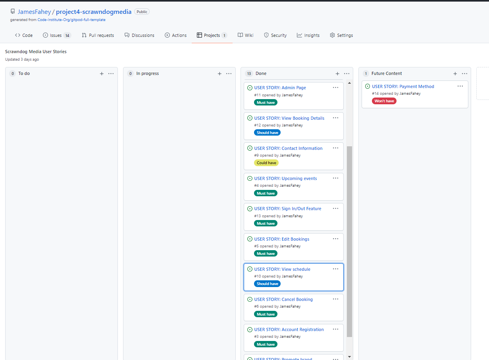

# Features

### Home page and landing image for all users. 

This image was chosen to convey to the user one of the primary services the site will be offering. The business logo is also positioned centrally where the users eyes will be initially drawn promoting the brand as soon as a user visits the site.

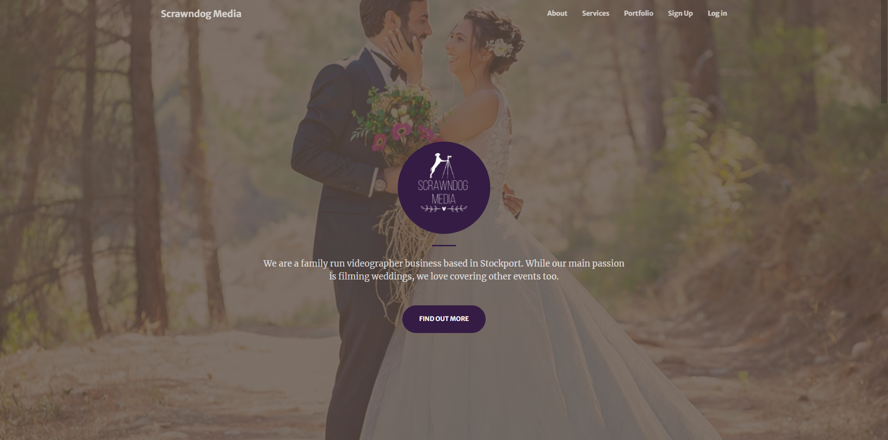

### Nav bar – all users

The navbar for all users will focus on promoting the business highlighting previous work and services on other

### Nav bar – registered users

Once registered users will have access to more options such as booking forms, booked events and a business calendar

### Portfolio

Here the site owner can promote their latest work with the goal of generating further business

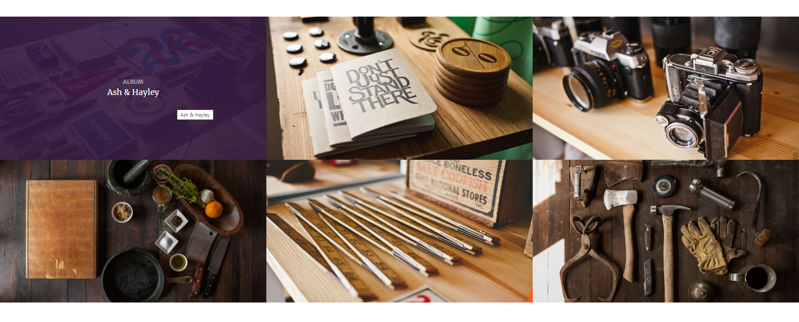

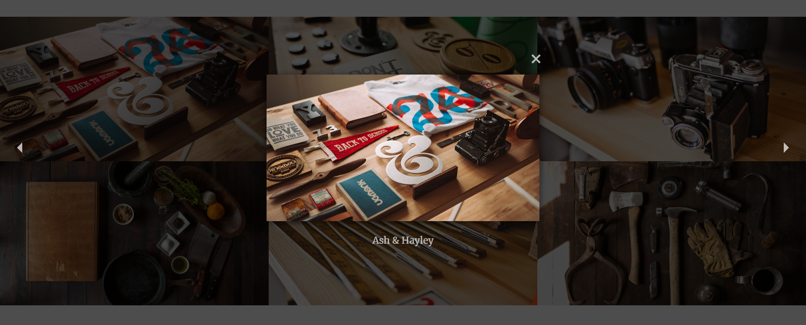

### Social links

Social links for users to follow the business’ social platforms

### Sign up

From the sign up page users can register in order to access the rest of the site

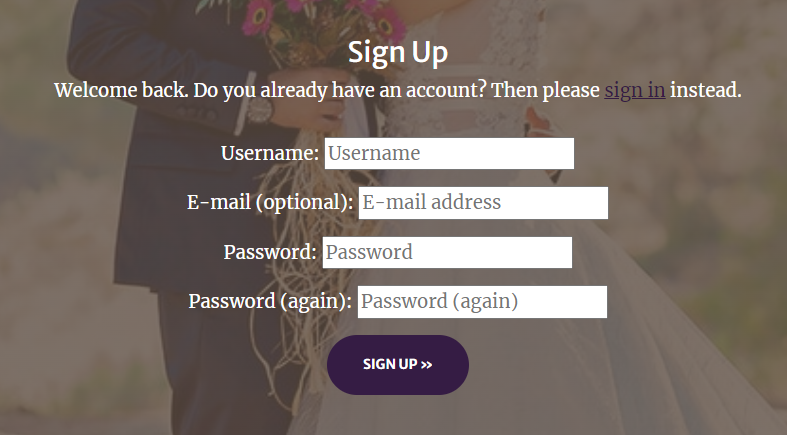

### Log in

A log in page for returning users

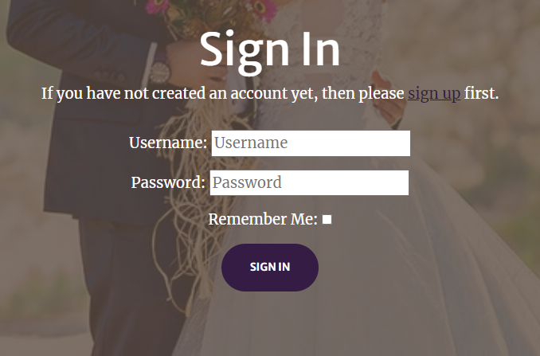

### Log out

Users will be asked to confirm their decision to log out

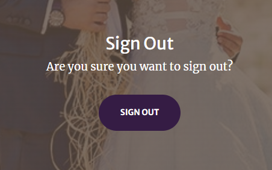

### Events page

Here registered users can view their booked events. They will be listed in date order and also indicate whether they have been accepted or still waiting for an update from the site owner. Users will also have the option to either edit or delete their events.

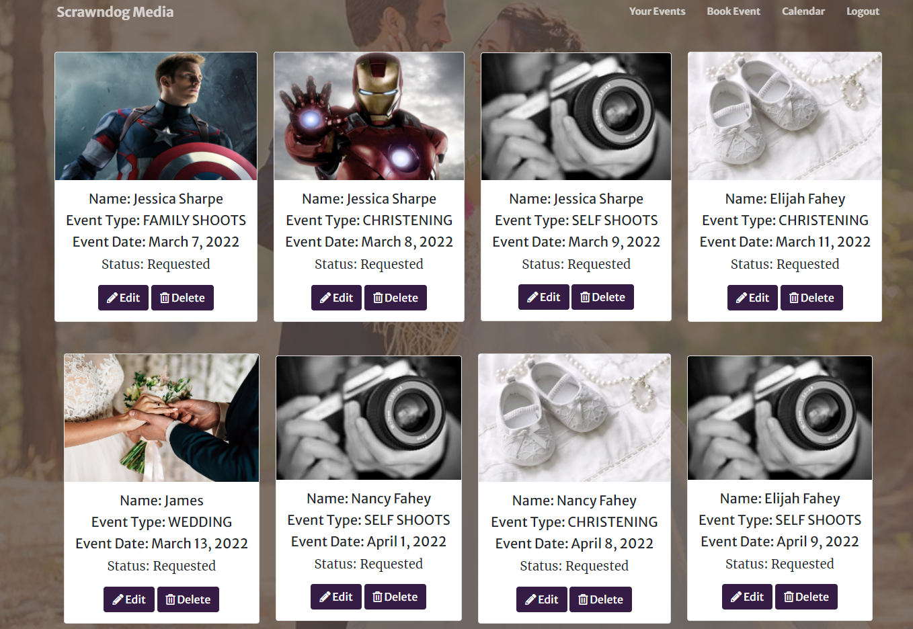

### Event details

Users will be able to click on bookings in order to see all of the bookings information

### Booking form

Here registered users can complete a booking form for any of the events on offer. Once the form has been completed their events page will be updated with the request and they will be notified that someone will be in contact shortly.

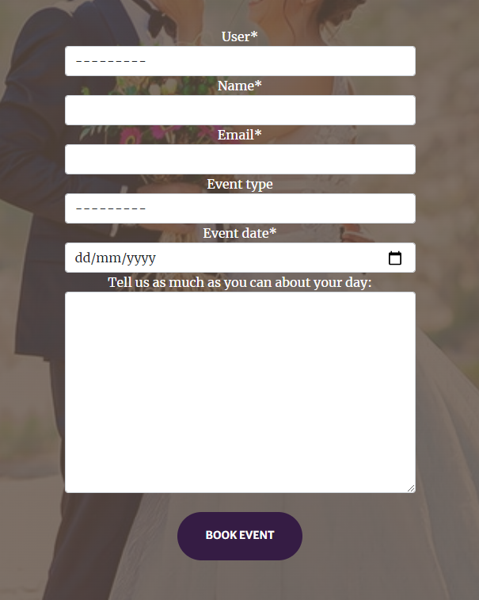

### Edit form

If the user decides to edit one of their events they will follow the link to a prepopulated form, with the previous details provided, where they can make changes to any of the fields

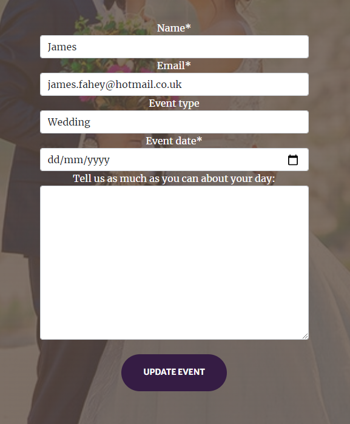

### Delete event

If the user decides to delete an event, they will be directed to a page to confirm their decision. They will also be provided with information regarding refunds.

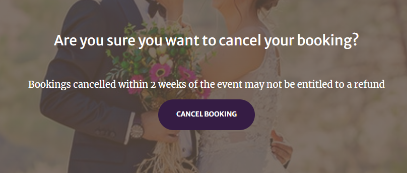

### Calendar

Registered users will be able to view the current months calendar in order to see which dates are available

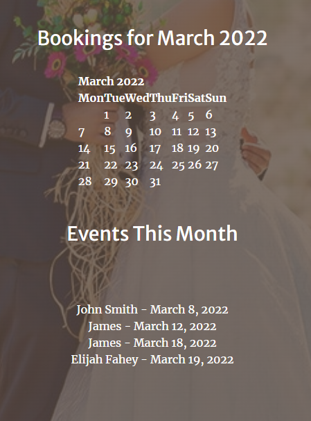

# Site Design

For the site I used a boostrap template from startbootstrap.com called creative. I have updated images and colours to fit the style of the brand

### Fonts

I chose not to update the fonts used by the template as I felt it worked well with the brand design.

The primary font used was Merriweather

### Colour scheme

The colour scheme has been chosen to complement the predominant colour of the logo. With the logo colour being a dark shade of purple, I used google to find further colours to use for the site

- color: # 351c44| This is the colour of the site logo and has been used for sections of the home page, ‘At your service’ text, submit buttons throughout the site, social links
- color: # 9CAF88| Hover effects offer a good contrast to the primary colour of the logo.
- color: # fffff| white has been used for large portions of text as it offers good contrast to the background image and colour scheme
- color: # b69426| used for the hover effect on the navigation links

### Balsamiq Wireframes

   * [Desktop](assets/readme_imgs/wireframes/desktop/)

   * [Mobile](assets/readme_imgs/wireframes/mobile/)

### Structure

I have kept the structure simple and clean to not overload the customer. The homepage contains information the promote the business and highlight the owners previous work. 
The website focuses on a booking app for events.

All visitors to the site can view brand information and portfolios however a user must register/login to have access to:

- Book Event
- Your events
- Calendar
- Edit Event
- Delete Event

# Testing

### Unittesting

I predominantly chose to do manual testing but to demonstrate unittesting I chose to focus on the url.py. I carried out 8 tests all coming back successfully

### Manual Testing by User Story

### Epic: As a site user/admin I have the option to register or sign into the site

From the home page users can access either the register/signup or log in page by using the nav bar situated at the top right of the page

- As a site owner I can access an admin page so that I can manage site content 

A superuser was created allowing access to an admin page. There the owner has access to all backend information including users and bookings

- As a site user I can register an account so that I can book an event

Once a user has registered, they will be granted further site access including a booking page

### Epic:  As a site user/admin I can create and view bookings

Once a user has registered, they will be granted further site access allowing them to make bookings or view bookings

- As a registered user I can book an event through the site so that I do not need to call

To book events a registered user will have access to a booking to complete. The form will request name, email, event type and date, then any other information the videographer/photographer may find useful

- As a registered user I can see my booked events so that I can keep track of bookings

After a booking form has been completed it will be added to their events page waiting to be confirmed by the admin

- As a registered user I can click on a booking so that I can see all information for that booking

On the events page a user can select a booking access the bookings own page and all further info regarding the booking will be provided

- As a user I can see upcoming bookings so that I can see which dates are available

A calendar page has been provided to registered users showing all upcoming bookings

### Epic:  As a site user/admin I can edit and delete bookings

Users have the option to edit and delete bookings from either the events or further details page

- As a site user/ business owner I can edit booked events so that I can manage my bookings

Users have the option to edit bookings once they have been made. This can be anything from event type to event date. Once this change has been made it will once again need to be confirmed by the admin

- As a site user/ business owner I can cancel bookings if necessary

Users have the option to delete bookings if necessary. Extra warnings regarding refunds will be provided also a confirmation feature to make sure the user meant to delete the booking

### Epic:  As a site admin I can manage my diary and confirm bookings

After creating a superuser, the admin of the site can view all bookings and manage their diary accordingly

- As a Business owner I can confirm booking request so that I can manage my workload

After a user has completed a booking form the business owner can access the admin page and confirm which bookings have been accepted

- As a business owner I can order and filter bookings to better manage my diary

The admin page will allow the business owner to filter by date and event type. This will be crucial for managing their diary and workload 

### Epic: As a business owner I can promote the brand

The main page of the site will be accessible to all users and provide users with the main concepts of the business as well as work and social links

- As a Business owner I will have the brands logo prominent on the home page

The business logo will be prominent on the main page as well as the favicon logo

- As a Business owner I can add my work to the site for users to see

On the homepage there will be a section for portfolios. Here the site owner can add their latest work for users to view

### General Manual Testing

#### Registering

To test the sign up function I tried to sign up without completing the required field. All gave the below message. I also attempted to sign up without meeting the password requirements, this also failed

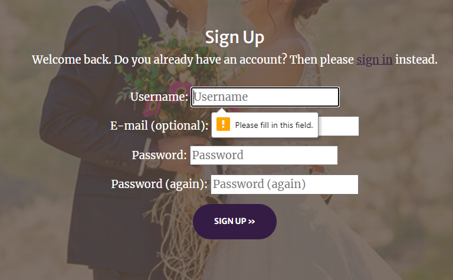

Once all required fields are completed sign up will be complete and you will have registered for an account

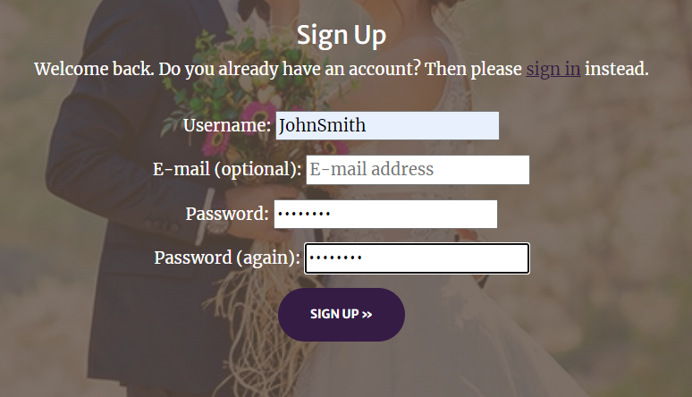

#### Log in

For log in testing, I attempted to sign in without completing the fields. I also tried logging in with an incorrect username and incorrect password

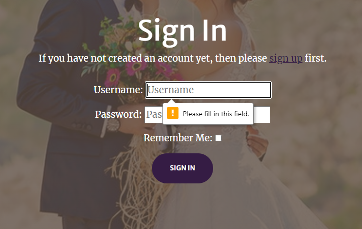

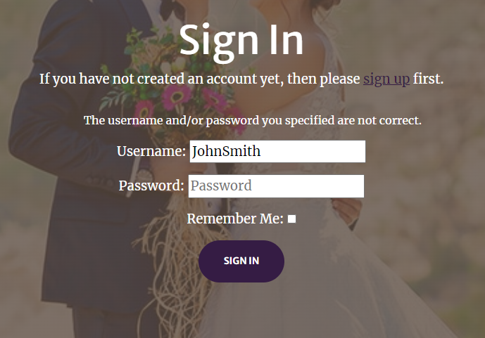

#### Log out

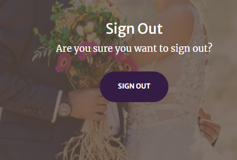

### Sign in/Register and log out messages

Once a user has either logged in, logged out or registered they should receive a success message

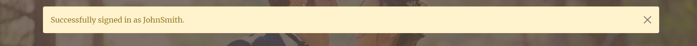

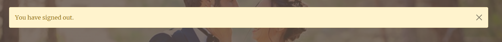

### Booking Form

To test the booking form again I tried to complete the form without completing all fields. The text box is optional so not required to complete form

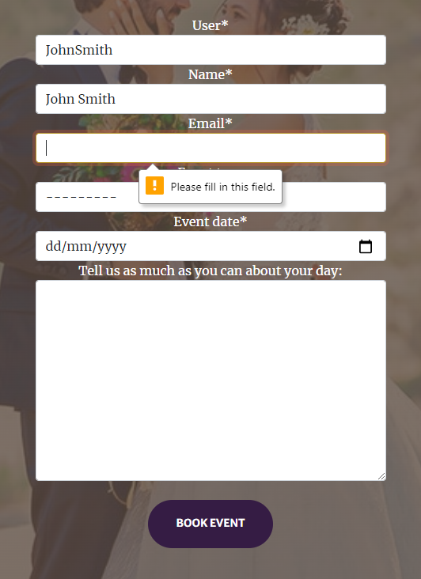

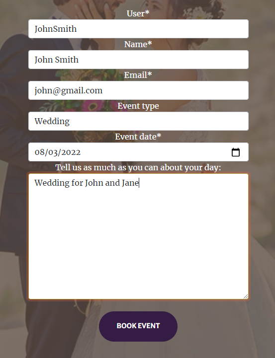

If the form was completed successfully you will be redirected to the events page and your booking added awaiting confirmation

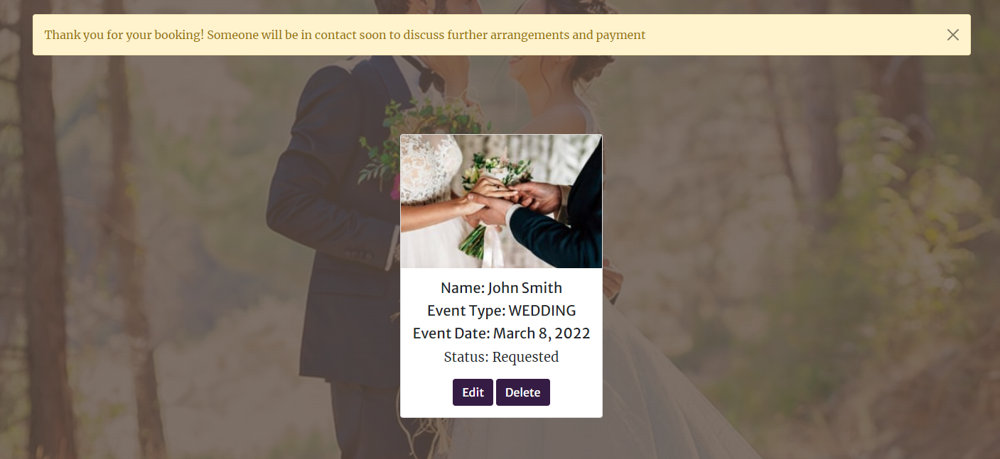

### Edit Form

To test the booking form I altered one of the prepopulated columns 

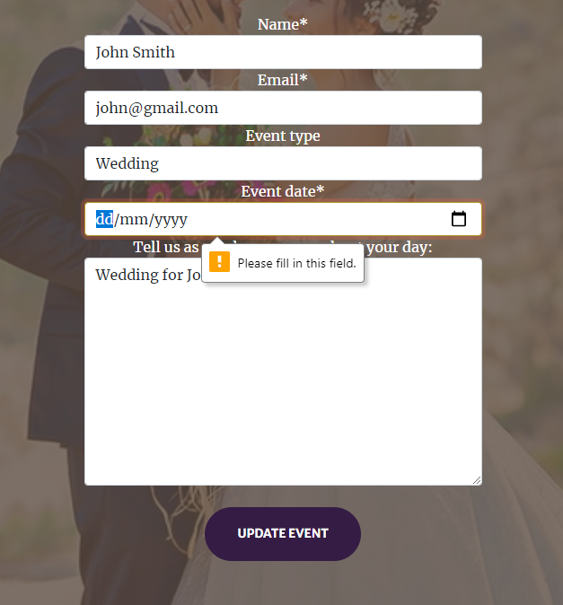

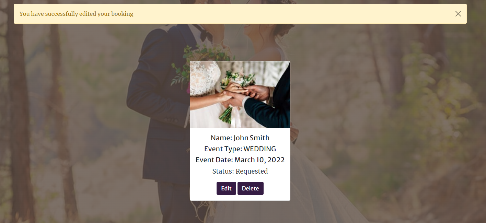

### Delete booking

Testing to see if you get prompted before deleting a post

### Admin

First I tried to access the admin page while still logged in as another user

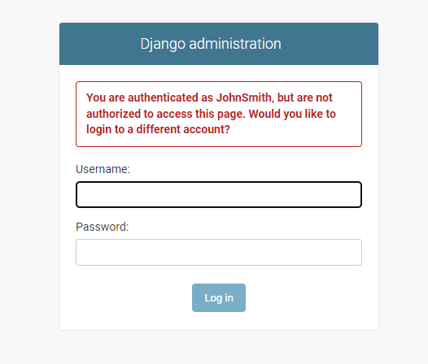

Once logged in as admin I filtered for the booking we created during testing

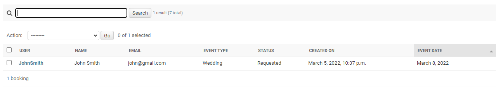

I then updated of the status from requested to confirmed

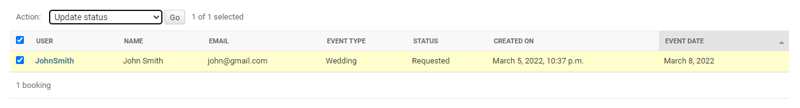

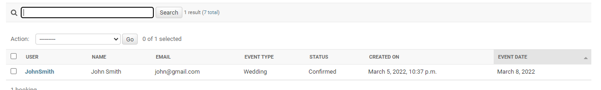

I also signed back into the account used for testing to see if the status had been updated on the site

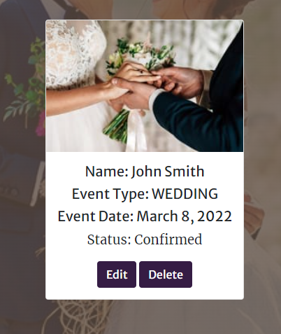

### User testing

I have asked friends and family to use the sites functionality with no reports of issues. Feedback was primarily for design and choice of wording on the homepage. I saw the lack of feedback for functionality as a plus as everything was working as intended 

### Bugs/Issues

Footer was being pulled into header tag. As I used styling from the base.html across all pages the main bulk of content was included in the header to keep the site consistent. The block content function was not registering the closing header tag so the footer was floating underneath the page content rather then sticking to the bottom of the page. I vaidated my code a seen I was missing closing functions on my base.html. Adding these rectified the footer problem however I was left with extra closing tags on my index.html.

I originally wanted to assign each event type a particular image so once the user had selected their event, on their event page it would generate the image on the html card. Discussing this with my mentor he advised this could become repetitive seeing the same images. Allowing the user to select their own image adds more choice to the customer while making it more personal to them.

When signing up for an account if the user completed the optional email field they would get a server error 500. This was due to the backend unable to access or deal with the email. I added the code “EMAIL_BACKEND = 'django.core.mail.backends.console.EmailBackend'” taken from stackoverflow and it resolved the issue. 

### Features to be implemented

### Payment method

The next implementation for the site would be a payment method for the bookings. This would allow transactions to be completed all in one process. Doing this the way of accepting bookings would have to change. Currently the owner can manage their diary through the admin page and deal with any days selected multiple times. Continuing with this method would result in having to offer refunds if users chose the same day

### Add and create further portfolios

Currently Scrawndog Media is a starter company and is in the process of taking their first bookings. This resulted in not a lot of material for the site hence why on the portfolio section I have had to use placeholder images. Once these bookings have been completed the source material can be added to the site.

### Email confirmation

I would like to add an email confirmation for sign up and booking. Once the user has either registered for an account or booked event they will received an email from the site confirming their actions.

# Technologies Used

### Coding Languages

- HTML5 - Site structure.
- CSS3 - Site Design.
- Python3 - Used with Django.

### Libraries, Frameworks & Tools

- Django - Framework used to build the site and admin page.
- HerokuSQL - Database used in the project.
- Python OS - Used for os.environ to help with automated development DEBUG
- Markdown - Used for creating README.md document.
- Bootstrap 5 - Used for styling the site a framework addition to CSS3.

### Hosting Technologies

- Heroku - Deployment and hosting environment.
- Cloudinary - Storing images and static files.
- Github - Hosting Repository code.

### Testing Technologies

- Nu Html Checker - Validate HTML
- W3C CSS3 - Validate CSS
- PEP8 - Validate python code

# Code Validation

- The HTML templates were validated using W3 Validator. No errors were returned for the html segments.

- The CSS style sheet was validated using W3C Validator, no errors were returned.

- The JavaScript files were run through JSHint. Received the following warning message - 'const' is available in ES6 (use 'esversion: 6') or Mozilla JS extensions (use moz). This is a warning that browsers implementing versions of JS prior to es6 won't understand const. I added / jshint esversion 6 / to the top of my JS pages to let jshint know that the minimum language version I am targeting is es6.

- The code was validated using PEP8. No errors were returned.

# Deployment

This project was deployed using Heroku. Some of the steps in this deployment process are used to get the bare minimum of this project up and running prior to adding functionality. 

See the following steps to deploy below:

1. Login to Heroku and Create a New App.

2. Give the App a name, it must be unique, and select a region. 

3. Click on 'Create App'. This will take you to a page where you can deploy your project. 

4. Next, click on the 'Resources' tab and search for 'Heroku Postgres' in the Add-ons section to add the Heroku Postgres database to the project. 

5. Click on the 'Settings' tab at the top of the page. The following steps must be completed before deployment.

6. Scroll down to Config Vars (also known as Environment Variables) and click 'Reveal Config Vars'. Here the database URL is stored, it is the connection to the database, so this must be copied and stored within env.py file within the same directory as the manage.py file. 

The env.py files is where the projects secret environment variables are stored. This file is then added to a gitnore file so it isn't stored publicly within the projects repository.  

7. Next, the secret key needs to be created within the projects env.py file on GitPod and then added to the Config Vars on Heroku. Once added, go to the settings.py file on GitPod.

8. Within the settings.py file you need to import os, import dj_database_url and then write an if statement to import the env.py file in production to avoid an error. 

9. Then, we need to replace the current insecure secret key with **os.environ.get('SECRET_KEY')**, that we set within the env.py file. 

10. Once the secret key is replaced, scroll down to DATABASES to connect to the Postgres database. Comment out the current code and add the following python dictionary:
DATABASES = {
    'default': dj_database_url.parse(os.environ.get('DATABASE_URL'))
}

11. The next step is to connect the project to Cloudinary, which is where the media files will be stored. Log into Cloudinary and copy the API environment variable. This needs to be added to the Config Vars on Heroku and to the projects env.py file, removing the 'CLOUDINARY_URL = ' from the beginning of the copied API link. 

12. Then on Heroku add to the Config Vars, DISABLE_COLLECTSTATIC = 1, as a temporary measure to enable deployment without any static files, this will be removed when it is time to deploy the full project.

13. Back onto GitPod, the cloudinary libraries installed now need to be added to the list of installed apps within the settings.py file - 'cloudinary_storage' and 'cloudinary'

14. Next we need to tell Django to use Cloudinary to store our media and static files. Toward the end of our settings.py  file we can add:

- STATIC_URL = '/static/'
- STATICFILES_STORAGE = 'cloudinary_storage.storage.StaticHashedCloudinaryStorage'
- STATICFILES_DIRS = [os.path.join(BASE_DIR, 'static')]
- STATIC_ROOT = os.path.join(BASE_DIR, 'staticfile')
- MEDIA_URL = '/media/'
- DEFAULT_FILE_STORAGE = 'cloudinary_storage.storage.MediaCloudinaryStorage'

15. Then we need to tell Django where the templates will be stored. At the top of settings.py, under BASE_DIR (the base directory), add a templates directory and then scroll down to TEMPLATES and add the templates directory variable to 'DIRS': []. 

16. Next, create the three above directories, media, static and templates, on the top level with the manage.py file. 

17. Now add our Heroku host name into allowed hosts in our settings.py file, APP_NAME.herokuapp.com, and then also add 'localhost' so the app can also run locally.

18. Finally, to complete the first deployment set up of the skeleton app, create a Procfile so that Heroku knows how to run the project. Within this file add the following:
web: gunicorn foody_family.wsgi
Web tells Heroku to allow web traffic, whilst gunicorn is the server installed earlier, a web services gateway interface server (wsgi). This is a standard that allows Python services to integrate with web servers.

19. Now, go to the 'Deploy' section on Heroku. Find the 'Deployment Method' section and choose GitHub. Then, connected to the relevant GitHub Repository by searching the repository name and clicking 'Connect'. 

20. Scroll down to the Automatic and Manual Deploys sections. I then clicked 'Deploy Branch' in the Manual Deploy section and waited as Heroku installed all dependencies and deployed my code. 

21. Once the project is finished deploying, click 'view' to see the newly deployed project. 

22. Before deploying the final draft of your project you must: 
- Remove staticcollect=1 from congifvars within Heroku 
- Ensure DEBUG is set to false in settings.py file or:
    - Set DEBUG to development with: *development = os.environ.get('DEVELOPMENT', False)* above it.

23. To deploy re-do steps 19 - 21, minus reconnecting your GitHub account as it should still be connected to your App. 